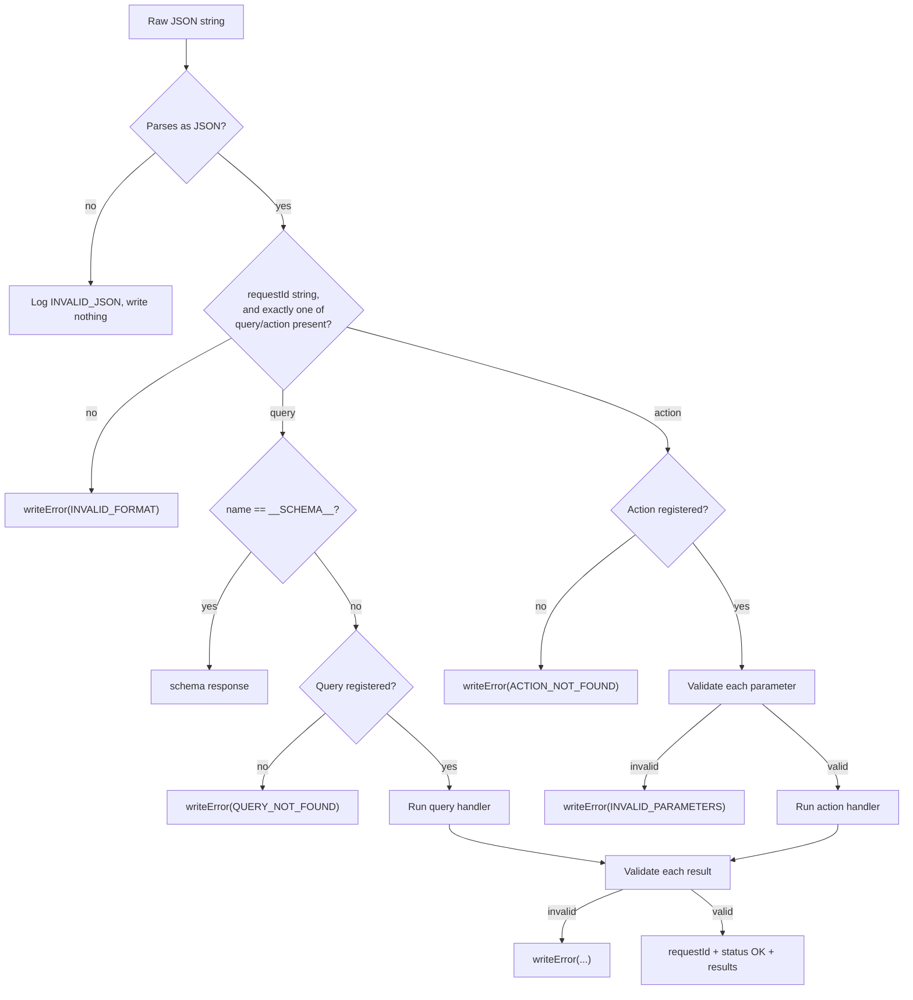

# Architecture

## Transport-agnostic by design

EspCommander never touches a network stack, a serial port, or a radio. Every entry point takes a JSON string in and, where applicable, writes a JSON string out through a caller-supplied buffer:

```cpp
void request(const char *jsonStringRequest, char *jsonStringResponse, size_t jsonStringResponseSize);
```

You decide how `jsonStringRequest` arrived (MQTT message, HTTP body, ESP-NOW frame, BLE characteristic write, Serial line) and what happens to `jsonStringResponse` afterwards (publish, HTTP reply, another ESP-NOW frame). This is what "framework agnostic" means in practice: swap transports without touching a single query or action definition.


## Two protocols for two power profiles

The library splits into two independent families that share the same building blocks (`Value`, `Serializable`, `HandlerValue`) but implement different protocols:

- **`Device` / `Query` / `Action`** — a synchronous request/response protocol keyed by `requestId`, for devices that are reachable at any time.
- **`SleepyDevice` / `SleepyQuery` / `SleepyAction`** — a push-and-poll protocol for devices that are unreachable most of the time. See [Sleepy Devices](./sleepy-devices) — using this half of the library **requires** a store-and-forward gateway.

## Request lifecycle (`Device`)



Every terminal node above is a distinct outcome documented in full in [Device](./device) and the [error code reference](../troubleshooting#error-codes).

## Validation happens twice, symmetrically

`Value::validateParameter()` and `Value::validateResult()` are mirror images of each other:

- **Inbound** (`validateParameter`): reads a field out of the request's `parameters` JSON object, checks its JSON type matches the declared `ValueType`, checks range/enum/color constraints, and — if everything passes — stores it into a `HandlerValue` for your handler to read.
- **Outbound** (`validateResult`): reads the `HandlerValue` your handler produced, checks it holds the type it's supposed to (and re-checks range/enum constraints, since a handler could in principle put an out-of-range value in), and writes it into the response's `results` JSON object.

This means a handler can never receive a parameter of the wrong type, and a malformed result from a handler is caught before it's serialized rather than silently sent.

## Zero-heap by construction

Every collection in the public API is an `etl::span` over an array **you** own (queries, actions, parameters, results) — nothing is copied into a dynamically sized container. Handler outputs live in fixed-size stack arrays (`HandlerValue[ESP_COMMANDER_MAX_PARAMETERS]`, `HandlerValue[ESP_COMMANDER_MAX_RESULTS]`) sized from `Config.h`. The one place JSON documents need scratch memory — `ArduinoJson::JsonDocument` — is satisfied by `StaticBufferAllocator`, a fixed-buffer arena (see [Memory Management](./memory-management)) instead of the heap.

## Next

- [Values & Types](./values-and-types)
- [Queries & Actions](./queries-and-actions)
- [Device](./device)
- [Sleepy Devices](./sleepy-devices)
- [Memory Management](./memory-management)
